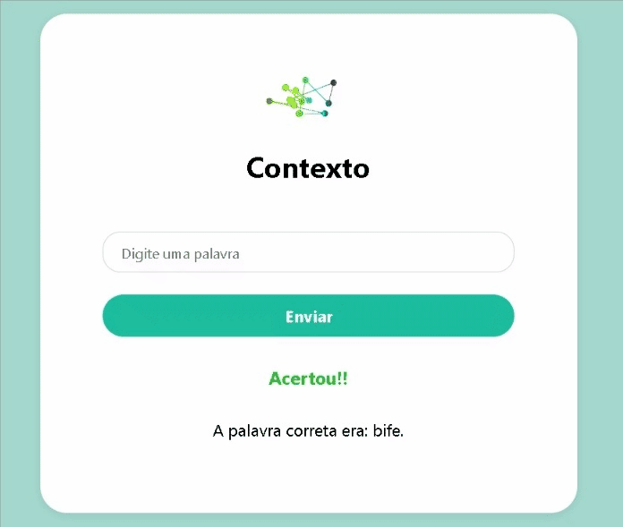
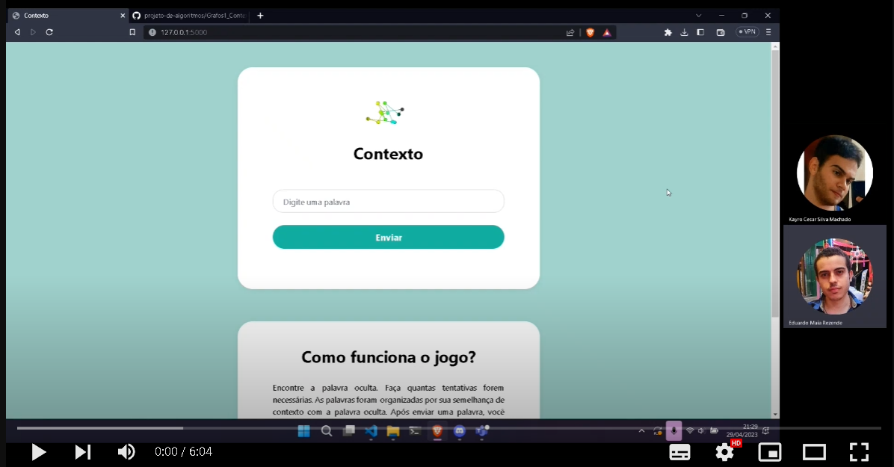

# Contexto

**Número da Lista**: X<br>
**Conteúdo da Disciplina**: Grafos 1<br>

## Alunos
|Matrícula | Aluno |
| -- | -- |
| 18/0119231  |  Eduardo Maia Rezende |
| 17/0107426  |  Kayro César Silva Machado |

## Sobre 
 Contexto é um jogo de adivinhação de palavras e funciona da seguinte maneira: os jogadores devem adivinhar uma palavra qualquer, assim o jogador receberá uma resposta do quão próximo o seu palpite está da palavra certa. Por exemplo, se a palavra for "esportes" e o jogador escrever "futebol", o jogo indicará que o palpite está muito próximo da palavra correta. Isso ocorre porque ambos os termos fazem parte do mesmo contexto, como o próprio nome do jogo sugere.

## Screenshots



## Video de Apresentação
[](https://www.youtube.com/watch?v=-uWtM48wCGc)

## Instalação 
**Linguagem**: Python<br>
**Framework**: Flask<br>

- Dependências:
  - Flask
  - Pandas


### Passo 1:
 Caso não possua as dependências descritas acima, instale-as na pasta raiz do projeto utilizando comando abaixo:
```sh
pip3 install -r requirements.txt
```
### Passo 2:
Entre na pasta **src** do projeto e execute o arquivo principal  com o comando abaixo:
```
python3 app.py
```

## Uso

Acesse a porta 5000 a partir do link [http://127.0.0.1:5000/](http://127.0.0.1:5000/), digite uma palavra e clique no botão enviar.


